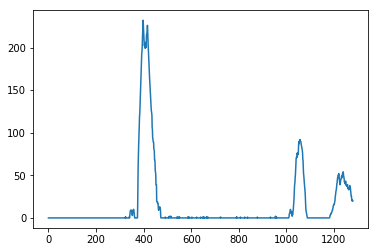

## Advanced Lane Finding

The Project
---

The goals / steps of this project are the following:

* Compute the camera calibration matrix and distortion coefficients given a set of chessboard images.
* Apply a distortion correction to raw images.
* Use color transforms, gradients, etc., to create a thresholded binary image.
* Apply a perspective transform to rectify binary image ("birds-eye view").
* Detect lane pixels and fit to find the lane boundary.
* Determine the curvature of the lane and vehicle position with respect to center.
* Warp the detected lane boundaries back onto the original image.
* Output visual display of the lane boundaries and numerical estimation of lane curvature and vehicle position.

# Preprocess
## Camera Calibration

Using a series of images of a 6 x 9 checkerboard from different angles, we're able to compute the necessary transforms to correct distortion in an image. OpenCV finds the corners of each checkerboard and maps them, then computes where they are supposed to be. This is done in `cv2.findChessboardCorners()`

Detecting corners (distorted):  

Calibration is done with `cv2.calibrateCamera()` and then undistortion is with `cv2.undistort()`

Undistorted checkerboard:  
  

Here is a distorted frame from the video:  

...and now undistorted:  

## Create thresholded binary image

Next we convert the image to binary using the `binarize(img)` function. This function converts the image to the HLS color space, which is able to withstand light variation better than RGB. We isolate the S channel as it is visible more often on the road. We then use a threshold of values on the HLS to pull out the yellow and white lane lines. We also make a grayscale image, and apply a Sobel to in the X direction. These are then combined into a binary image. `binarize(img)`

Binary image:  

## Region of interest

Define four points roughly around where the lane lines will be and delete other content. `region_of_interest(img)`

## Birds Eye View

We then take four points that are roughly the lanes and warp the perspective to see a "birds-eye" view. This will make it much easier to detect the lane lines, curvature, and distance from center. `birds_eye(img)`

# Find lane lines
## Histogram

We can use a histogram to roughly show where the lane lines will be. The peaks are in the areas with the most white.

## Lane lines with no prior knowledge
Using a sliding window search, we can find the most prominent peaks and slide up the window to detect the shape of a lane. We then fit a polynomial to this to get a single line. `find_lanes(img)`

## Lane Lines with previous lane knowledge
If we already know the location of the lane lines from the previous frame, we can search just within a window around where our previous was to find a good fit. `find_next_lane(...)`

## Measure curvature of lane
We have conversions form pixels to meters in either direction, and use those to estimate distances. This is done using the radius of the circle that it forms and the distance between the two lines in the x direction. `measure_curvature(..)`

## Draw lanes on original image
Using `cv2.polylines` we draw our lane lines on a warped blank image, and then use the inverse of the perspective matrix we used to warp the image to birds eye to convert it back. This is then combined with the original image and then we overlay text of the curve radius and distance from center. `draw_lanes(...)`

